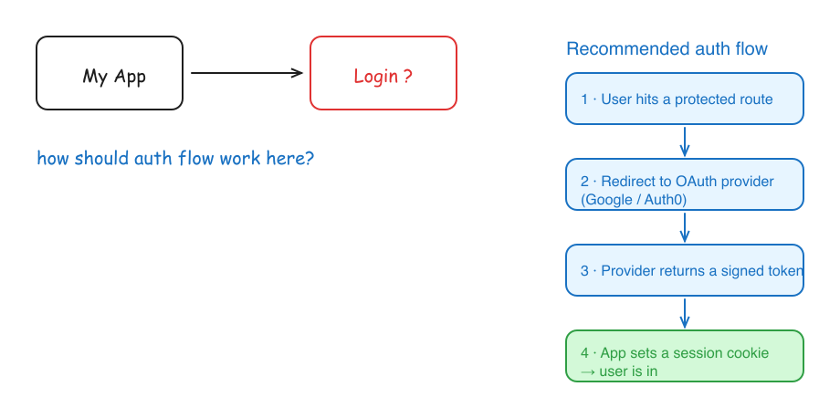

# sam-canvas

**一块你和 AI 编程助手共享的实时画布。**

你在浏览器里的无限 Excalidraw 画布上随手画草图；你的 AI 助手——Claude Code，或任何能执行命令行的工具
——会**结合你项目的完整上下文**读懂你画的东西，并把图示回答直接画回同一块画布上，实时更新。不用再把
截图粘到聊天框里。

[English](README.md) · 简体中文 · [繁體中文](README.zh-Hant.md) · MIT 许可证



*左边是一张随手草图；右边是助手读懂之后，用蓝色画在同一块画布上的回答。*

## 为什么做它

用聊天框跟 AI 交流，你得先把脑子里的空间想法翻译成文字。独立的 AI 白板虽然能画，但它的模型只看得到画布
本身——对你的代码库、你们刚才聊的内容一无所知。

sam-canvas 既保留了「画」这件事，又把它接到**你自己的**助手上——那个本来就了解你在做什么的助手。你在画布上
思考，它在画布上回应，而且它真的知道你在忙什么。

## 运行环境

- **Python 3.8+**（只用标准库，无需 `pip install`）
- 一个现代**浏览器**（Excalidraw 从 CDN 加载，首次使用需要联网）
- 一个能执行命令行的 **AI 编程助手**（比如 Claude Code）。可选，但这正是它的意义所在。
- 可选：`rsvg-convert`（来自 `librsvg`）用于生成 PNG 预览；没有它也能生成 SVG 预览。

## 快速开始

```bash
git clone https://github.com/HyperfocuSam/sam-canvas.git
cd sam-canvas
./start.sh            # 启动本地服务（端口 3899）并打开画布
```

画点东西，然后让你的助手来回答（见下文）。你画的内容会随手自动保存，助手随时都能读取——不需要「导出文件」
这一步。

## 工作原理

```
你在浏览器里画 ──自动保存──▶ canvas.excalidraw
                                 │  （结构化 JSON：精确的图形与文字）
              助手读取它 + 你的项目上下文
                                 │
              助手设计出图示回答 → response.json
                                 │
              canvas.py merge  ──▶  ada-* 元素写入同一个文件
                                 │
        页面每约 1 秒轮询一次，实时显示回答——无需刷新
```

- **天生不会互相覆盖。** 你和助手各自拥有文件的一半：浏览器只写你的元素，助手只写 `ada-*` 元素。你的成果
  永远不会被覆盖。
- **可折叠。** 顶栏有个按钮，能把整块画布收成角落里的小标签，再点一下展开。
- **只监听本机。** 服务绑定在 `127.0.0.1`，不对外暴露。

## 配合 Claude Code 使用

[`claude/`](claude) 目录里备好了现成的 skill 和 `/sam-canvas` 命令。把这个目录设为 Claude Code 的落地位置
（`export SAM_CANVAS_HOME=/path/to/sam-canvas`），再把 `claude/skills/sam-canvas` 和
`claude/commands/sam-canvas.md` 复制到你的 `.claude/` 文件夹。然后：

1. 输入 `/sam-canvas` → 画布打开。
2. 画草图，然后说「看一下」或 `/sam-canvas 把这个整理成架构图`。
3. Claude 读懂你的草图，结合你的代码库理解它，把回答画在画布上。

## 配合任何助手使用

整个对接就是三条命令行——读取、生成 JSON、合并。完整约定和 Excalidraw 元素格式见
[`docs/for-agents.md`](docs/for-agents.md)。

```bash
python3 canvas.py summary                 # 读取当前草图（类型、文字、外接框）
# ……你的助手把回答设计成 Excalidraw 元素 → response.json……
python3 canvas.py merge response.json     # 约 1 秒内出现在实时画布上
python3 canvas.py preview                 # 可选：生成 canvas-preview.png 复核一下
```

## 配置

| 环境变量 | 默认值 | 作用 |
|---|---|---|
| `SAM_CANVAS_PORT` | `3899` | 服务监听的端口 |
| `SAM_CANVAS_FILE` | `./canvas.excalidraw` | 共享画布文件的路径 |

停止服务：`kill $(lsof -tiTCP:3899 -sTCP:LISTEN)`。清空画布：`python3 canvas.py init`。

## 致谢与许可

基于 [Excalidraw](https://github.com/excalidraw/excalidraw)（MIT）构建。sam-canvas 以
[MIT 许可证](LICENSE)发布。
